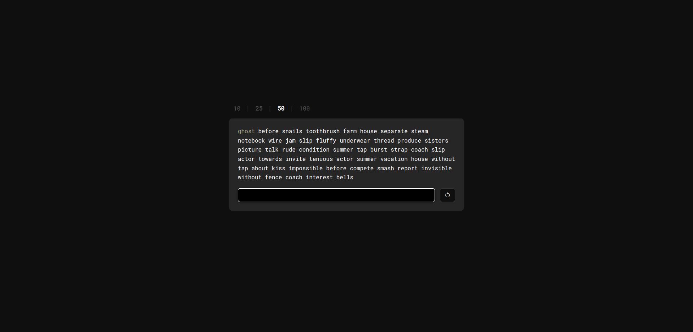
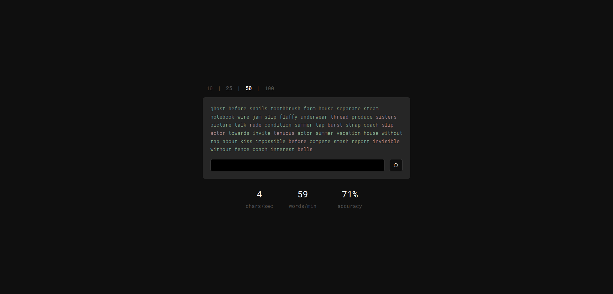

  

## Objectives of this project

- Test and calculate user's typing speed with a simple test
- Implement mininalist fronted using bootstrap framework
- Review of knowledge on javascript programming language

## TODO

- [x] Add results
  - Forumula for calculating speeds:
  - CPM: $Correct Characters Typed / Seconds$
  - WPM: $(Correct Characters Typed / 5) / Minutes$
  - Accuracy: $(Correct Characters Typed / Total Characters Typed) * 100$
- [ ] Add settings
- [ ] Add selection to type with number of words or with a timer
- [ ] Add selection to type with phrases or with random words
- [ ] Implement Light and Dark Theme

## Preview

## Inspiration

- This project is heavily inspired by [typings.gg](https://typings.gg/)
